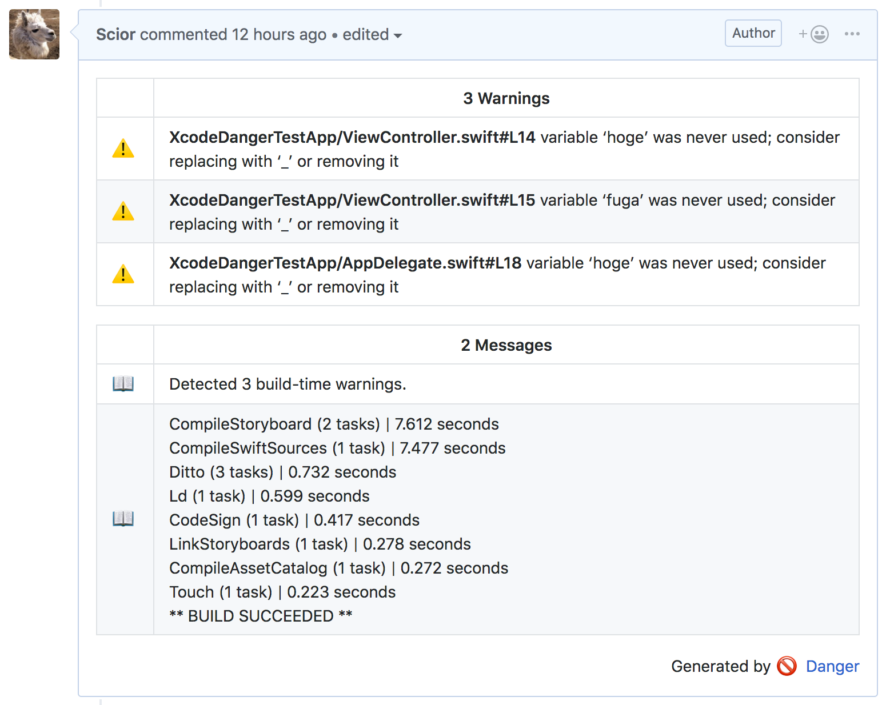

# danger-xcode_warnings

[](https://badge.fury.io/rb/danger-xcode_warnings)

[](https://developer.apple.com/xcode/)
[](https://opensource.org/licenses/MIT)

A Danger plugin to format and show warnings from `xcodebuild`.



## Features

- Extract the compiler and linker warnings from the build log and format them for Danger
  - Both `xcodebuild` and `xcpretty` format are supported
- Gather the build timing summary and show

## Installation

```sh
gem install danger-xcode_warnings
```

Or using Bundler,

```ruby
gem 'danger-xcode_warnings'
```

## Usage

### With xcodebuild

Firstly, collect the log from `xcodebuild`.

```sh
xcodebuild clean build -workspace ... > build.log
# If you want to show the log with xcpretty
xcodebuild clean build -workspace ... | tee build.log | xcpretty
```

And then, call `analyze_file` method in your `Dangerfile` to analyze the build log,

```ruby
xcode_warnings.analyze_file 'build.log'
```

with some shell scripts with your CI, like:

```sh
bundle install
bundle exec danger
```

### With xcpretty

If you want to analyze the xcpretty log, you MUST set the `use_xcpretty` flag in your `Dangerfile`:

```ruby
xcode_warnings.use_xcpretty = true
xcode_warnings.analyze_file 'build.log'
```

Your build script for CI should be like,

```sh
xcodebuild clean build -workspace ... | xcpretty > build.log
```

### Show linker warnings

To show linker warnings, set the `show_linker_warnings` to `true` before analyzing the log:

```ruby
xcode_warnings.show_linker_warnings = true
xcode_warnings.analyze_file 'build.log'
```

### Gathering build timing sumamry

To gather the build timing summary, you have to add `-showBuildTimingSummary` option to your build script:

```sh
xcodebuild clean build -workspace ... -showBuildTimingSummary > build.log
```

Then, set the `build_timing_summary` flag to `true`.

```ruby
xcode_warnings.build_timing_summary = true
xcode_warnings.analyze_file 'build.log'
```

### See also

`RubyDoc` for this plugin is here:

- <https://www.rubydoc.info/gems/danger-xcode_warnings>

## Development

1. Clone this repo
2. Run `bundle install` to setup dependencies.
3. Run `bundle exec rake spec` to run the tests.
4. Use `bundle exec guard` to automatically have tests run as you make changes.
5. Make your changes.
